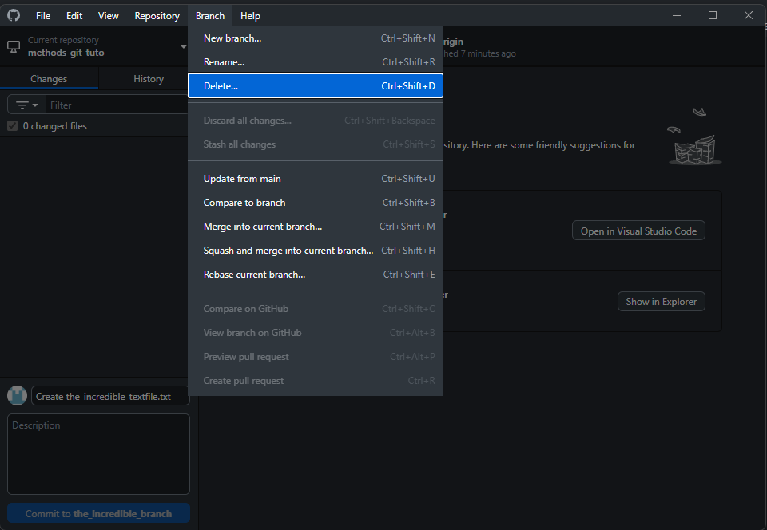
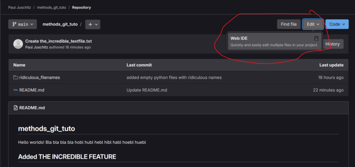

# Journal Club Git Turorial
hi
Below, you will find the basic commands and steps to:

1. Set an **initial configuration** on your local git installation.
2. **Create your own repository** on your Univie gitlab account
3. Create a **personal access token** (PAT) for authentication with gitlab
4. **Clone** that repository to your local machine
5. Create a **new branch**
6. Make **local changes** to your project
7. **Commit** the changes to your new branch
8. **Push** to the remote repository
9. **Add a new file** (and commit and push again)
10. **Merge** your newly created branch back into the main branch
11. **Fetch and Pull** changes from the remote repository to your local machine.

For commands, use PowerShell on Windows or the terminal on macOS and linux.
The directions come from the book [Pro Git](https://git-scm.com/book/en/v), 2nd edition (2014) and the [Gitlab documentation](https://docs.gitlab.com/). 

## 1.: Initial configuration of your local git installation

You will need to set your user name and email address. Every future commit you make is then linked to that identity. Open a terminal or PowerShell and run
```bash
$ git config --global user.name "John Doe"
$ git config --global user.email johndoe@example.com
```
the `--global` option sets that identity for your user on the PC that you are working on. This means that it will be used for any future repository you will be working on on that PC.

## 2.: Create a new repository

Log into [https://gitlab.phaidra.org/](https://gitlab.phaidra.org/) and start a new project, choose *Create blank project* and choose a project name. Leave the rest of the settings under *Visibility level* and *Project Configuration* as they are.


## 3.: Create a personal access token

In order to authenticate over https, you need to generate a *personal access token* (PAT).
- In Gitlab, navigate to User [Settings/Access tokens](https://gitlab.phaidra.org/-/profile/preferences) and select *Add new token*. About the settings:
    - Token name and description are only used here on Gitlab. Recognizability is potentially useful if you plan to use different tokens for different machines.
    - Expiration date is max. one year in the future. No need to worry about this because you when it has expired, you will simply get a new authentication prompt when trying to us it and can create a new token.
    - **Scope**: If you prefer to stay on the safe side check read_repository and write_repository. Otherwise, you can wo with complete api access.
- Click *Create* personal access token. You will be taken back to the PAT overview site. **Do not close it!** You only have this one chance to copy your freshly generated PAT for later use. Copy your new PAT and paste it in some place safe (a message to yourself on Slack is a popular choice).


## 4.: Clone your repository to your local machine.

- **Retrieve the project URL:**
    - In Gitlab, go to the site of the repository you have just created.
    - Click the *Code* button. The drop down menu shows the project URL to clone the repository using HTTPS. Copy it.
    

- Open the GitHub desktop app. If you are opening it for the first time, you will see a prompt to log into GitHub.
    - Because we are using Gitlab and not GitHub, you can *Skip this step.*
    

- Click *Clone a repository from the Internet...*
    - In the tab URL, paste your project URL and choose a local directory to clone where the project files will be stored.
    - Click *clone**
    

    - A dialogue titled *Authentication failed* will open. It has not failed, you just need your Gitlab username (FIRSTNAME.LASTNAME@univie.ac.at) and your previously created PAT.
    

## 5.: We want to add a new feature to our project, so let's create a **new branch** for that.

- In the github desktop app, open the branch dropdown menu and select New branch.
- Name your new branch, hit Create branch.
Done, you are now working on your new branch.


## 6.: Locally edit the **README.md**

- In the folder you've cloned your repository to, open the README.md and describe the changes you're making on this branch.
- Save and go back to the github desktop app. You should see the changes.

## 7.: Commit the change to your local repository

- Hit the commit button. In this case, the github desktop app has automatically created a commit message. For documentation, feel free to modify it or add a more detailed description.

The change is now tracked in git, but only on the machine you are working on. To get the change onto the remote repository, we need to Push it.


## 8.: **Push** to your remote repository

Hit `Ctrl + p` or click *Publish branch* (the github app calls pushing publishing)
You can now check the site of your repository in Gitlab. You should see a notification of that push. In the branch dropdown menu, you should see your newly created branch.


## 9.: Add a new file to your project.

- In the folder of your project, add some new file that adds to your incredible new feature.
- Go back to the github desktop app
    - Commit (don't forget a good commit message)
    - Push

Our new feature is now complete and working. We are ready to merge our feature branch back into the main branch.


## 10.: Merging the new feature branch back into the main branch

- In the github desktop app, go to the branch dropdown menu and select main.
    - You have now switched back to the main branch on your local machine. Have a look in your project folder. The file you've added in step 9 is gone.
- Again, go to the branch menu
    - Select *Choose a branch to merge into main*
    - Select the branch with your new feature
    - Hit *Create a merge commit*
    - You have now merged the changes from your feature branch back into the main branch.
- Push your changes to the remote repository (`Ctrl + p`)


Your new feature is now back on the main branch on both your local machine and the remote repository.
Since the work on your feature branch is done, you might as well delete it. To do so, head back to your feature branch, open the branch dropdown menu and hit Delete. You will be warned and asked whether you want to delete it on the remote repository as well. If you have deleted the branch, Push again.



## 11.: Making changes on the remote repository, fetching and pulling them to your local machine

If you are collaborating on your project with someone else or working on the project using different machines, you will encounter changes on the remote repository that need to be synced to the local machine you are working on. The two steps here are fetching and pulling.
We will simulate this by editing our project's README.md in the Gitlab web IDE.

- In Gitlab, go to your project page
    - Select Edit --> *Web IDE*
    - Navigate to the README.md and make some changes in the editor.
    - Navigate to *Source Control.*
    - Enter a commit message.
    - Hit *Commit and push to 'main'* (ignore the warning prompt).
    - Go back to the project page. You should now see the changes you have made to the readme.




The changes are now on the remote repository. If you want to work on the newest version on your local machine, we need to get the changes there.

- Open the github desktop app
    - Click *Fetch origin*.
        - The information about the changes is now on your local machine, but no changes have been made to your README.md yet.
    - To apply the changes, hit *Pull origin*.


